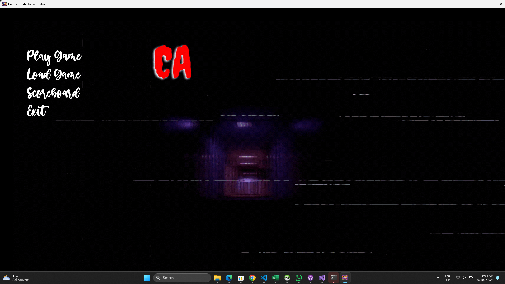
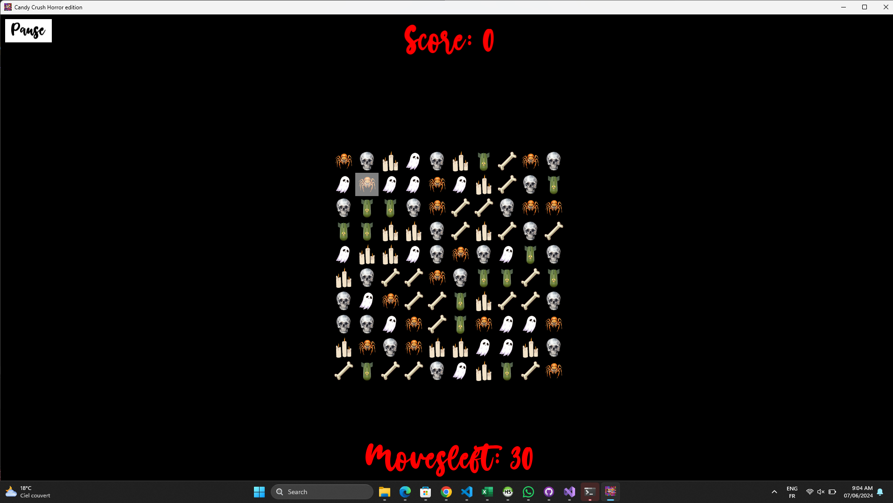

# Candy Crush Horror Edition

Candy Crush Horror Edition is a grid-based puzzle game similar to Candy Crush. The objective is to swap adjacent tiles to form alignments of at least three tiles of the same type. When an alignment is formed, the tiles disappear, tiles above them fall into the empty spaces, and new tiles fill the grid from the top. The game ends when the player exhausts the given number of moves, and the goal is to achieve the highest possible score.

## Features

- Multiple difficulty levels: Easy, Medium, Hard
- Animated tile swapping and refilling
- Saving and loading game states
- Score tracking and scoreboard display
- Pause and resume functionality

## Screenshots




## Installation

### Prerequisites

- C++11 or higher
- SFML 2.5 or higher

### Building the Game

1. Clone the repository:

```bash
git clone https://github.com/yourusername/candy-crush-horror-edition.git
cd candy-crush-horror-edition
